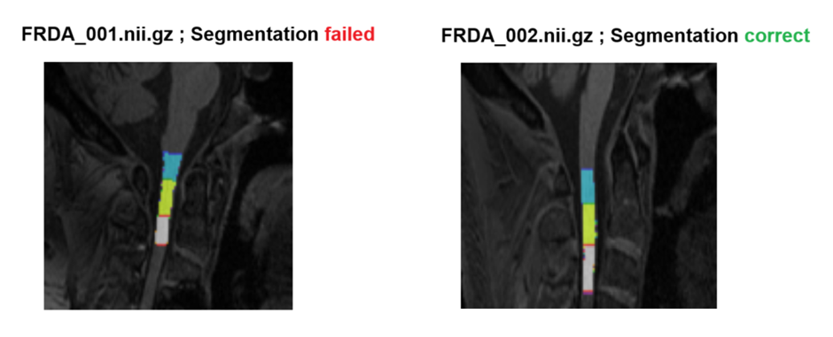

# QC_SpinalCord
Automated Quality Control based on Deep-learning algorithms for spinal cord imaging segmentation  

The containerization for automated QC can be used via **Docker** or **Singularity/Apptainer**. Here are some brief instructions on how to use it.  

You should have two folders: one with all the .nii.gz images and another with all the segmentation masks ending in _seg_labeled.nii.gz (e.g., image: c0001.nii.gz, mask: c0001_seg_labeled.nii.gz). The masks can be generated by either method ([SCT](https://spinalcordtoolbox.com/) or [Enigma-SC](https://github.com/art2mri-user/Enigma-SC)).   

The results will be generated within your image folder, a /Results folder will be created with two files, a .txt and a .pdf, both containing the segmentation results according to the **Figure 1** below. Thios classifications are based on the anatomical landmarks on the [Anatomical Ground Truth](/Installation%20Instructions.md) section.   

  

It's important to note that in some cases, it may generate a 'failed' result even for correct segmentations (~3% of images in our tests), so it's important to check the .pdf file to verify if the segmentation really failed. The .pdf file contains the image with the labeling.

Images with a 'correct' result are indeed correct, making it unnecessary to verify them. This pipeline can help save effort and speed up the QC checking process, and we hope it will be useful to you!

## Docker
Once you pulled the Docker image    

```bash
docker pull art2mri/qc_spinalcord:1.0
```

You are able to generate the results by typing the following command  

```bash
docker run -it --rm --gpus all \
-v /path/to/images_folder:/home/QC_pipeline/image \    #replace the /path/to/images_folder by the real path of your images folder
-v /path/to/masks_folder:/home/QC_pipeline/mask \      #replace the /path/to/masks_folder by the real path of your masks folder
-e MPLCONFIGDIR=/home/QC_pipeline/temp/matplotlib \    
--user $(id -u):$(id -g) art2mri/qc_spinalcord:1.0
```  

If you do not have an integrated GPU, simply remove the GPU flag **--gpus all** from the command.  

## Singularity/Apptainer  

First of all, clone this repository content by the following command  

```bash
git clone https://github.com/gustavojarola/QC_SpinalCord.git
```  

Once you cloned the content, please **rename the 'model.pth.zip' file at the QC_SpinalCord folder to 'model.pth'** and then build the Singularity or Apptainer image inside of the QC_SpinalCord folder following the command below   

```bash
singularity build qc_spinalcord.sif docker://art2mri/qc_spinalcord:1.0
```  

or 

```bash
apptainer build qc_spinalcord.sif docker://art2mri/qc_spinalcord:1.0
```  

You are now able to generate the results. Open a terminal inside of the QC_SpinalCord folder and follow the command below.  

```bash
singularity exec --nv \
    --bind /path/to/images/folder:/home/QC_pipeline/image \
    --bind /path/to/masks/folder:/home/QC_pipeline/mask \
    --bind /path/to/QC_SpinalCord/output:/home/QC_pipeline/output \
    --bind /path/to/QC_SpinalCord/:/home/QC_pipeline/temp \
    --env MPLCONFIGDIR=/home/QC_pipeline/temp/matplotlib \
    qc_spinalcord.sif python3 /home/QC_pipeline/main.py
```  
Where:  

```bash
singularity exec --nv \
    --bind `/path/to/images/folder`:/home/QC_pipeline/image \ #/path/to/images/folder -> replace by the path of images folder
    --bind `/path/to/masks/folder`:/home/QC_pipeline/mask \     #/path/to/images/folder -> replace by the path of masks folder
    --bind `/path/to/QC_SpinalCord/output`:/home/QC_pipeline/output \  #/path/to/QC_SpinalCord/output -> replace by the complete path to the output folder inside of QC_SpinalCord
    --bind `/path/to/QC_SpinalCord`/:/home/QC_pipeline/temp \  #/path/to/QC_SpinalCord ->  replace by the complete path to the temp folder inside of QC_SpinalCord
    --env MPLCONFIGDIR=/home/QC_pipeline/temp/matplotlib \   
    qc_spinalcord.sif python3 /home/QC_pipeline/main.py
```  
If you are using Apptainer, run the same command but substituting 'singularity' with 'apptainer'.  

In our tests, we achieved 97.8% accuracy for the labeling classification.  
